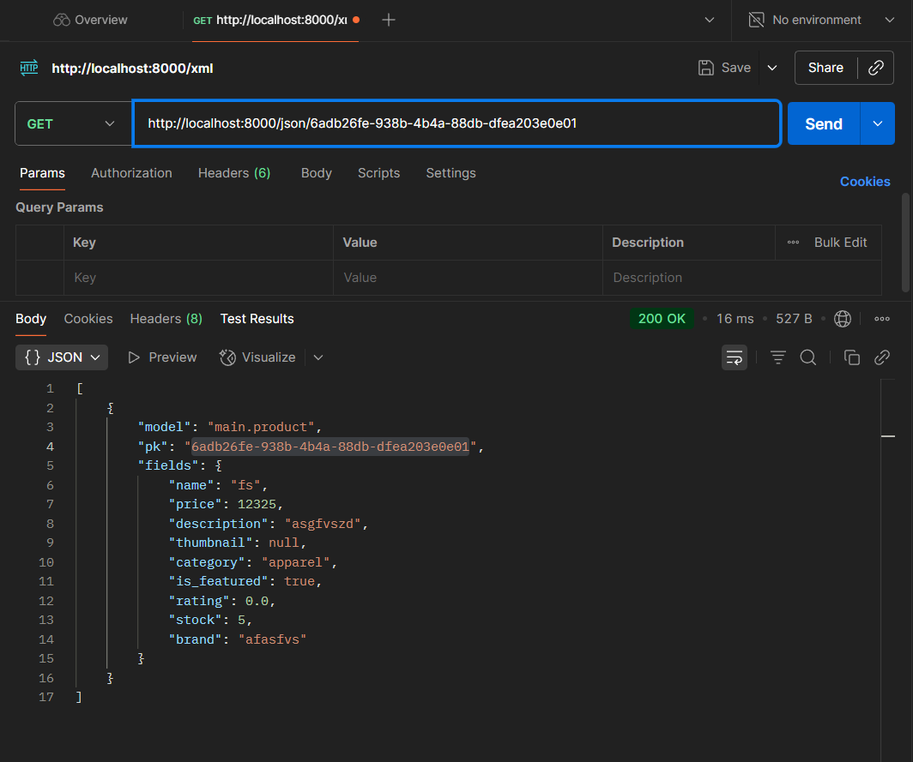

*****PERTANYAAN TUGAS INDIVIDU 2*****

1. Jelaskan bagaimana cara kamu mengimplementasikan checklist di atas secara step-by-step (bukan hanya sekadar mengikuti tutorial).
2. Buatlah bagan yang berisi request client ke web aplikasi berbasis Django beserta responnya dan jelaskan pada bagan tersebut kaitan antara urls.py, views.py, models.py, dan berkas html.
3. Jelaskan peran settings.py dalam proyek Django!
4. Bagaimana cara kerja migrasi database di Django?
5. Menurut Anda, dari semua framework yang ada, mengapa framework Django dijadikan permulaan pembelajaran pengembangan perangkat lunak?
6. Apakah ada feedback untuk asisten dosen tutorial 1 yang telah kamu kerjakan sebelumnya?

1) Pertama yang aku lakukan adalah bikin direktori baru dengan nama football-shop terus aku setup virtual environment biar semua dependency terisolasi. Dependency aku catat di requirements.txt biar gampang kalau mau install ulang. Setelah itu aku bikin project Django baru di folder itu. Lanjut, aku bikin file .env dan .env.prod buat nyimpen environment variables (biar setting database, secret key, dll nggak langsung ditaruh di code). Di settings.py, aku ubah bagian ALLOWED_HOSTS, nambahin "localhost" sama "127.0.0.1", terus juga konfigurasi lain yang sesuai sama project. Setelah itu, aku jalanin python manage.py migrate buat setup database default Django, dan cek apakah server bisa run dengan python manage.py runserver. Kalau udah jalan, aku bikin project baru juga di PWS (Pacil Web Service), terus nyesuaiin konfigurasi .env.prod ke environment di PWS. Jangan lupa juga tambahin domain PWS ke ALLOWED_HOSTS. Kalau udah, aku bikin aplikasi baru namanya main dan register aplikasi itu di INSTALLED_APPS di settings.py. Dari situ, aku mulai bikin template HTML sederhana yang isinya nama project sama data pribadi (nama + NPM). Lanjut, di models.py aku bikin model Product dengan atribut-atribut kayak nama, kategori, harga, dsb. Supaya lebih fleksibel, aku bikin CATEGORY_CHOICES (misalnya apparel, footwear, equipment, dll). Setelah model selesai, aku migrasi lagi biar databasenya ter-update. Nah, supaya data bisa muncul di browser, aku bikin function show_main di views.py buat handle request dan balikin template HTML tadi. Terakhir, aku konfigurasi urls.py baik di level project maupun aplikasi biar route ke show_main jalan.

2) Bagan saya simpan pada link berikut: https://drive.google.com/drive/folders/1f1BjTSOlmdooQeXsOvFRS28TCvJXVE6U?usp=drive_link . Pada aplikasi Django, alur request dan response berjalan berurutan melalui beberapa komponen utama. Ketika client mengirimkan HTTP request, permintaan tersebut pertama kali diterima oleh urls.py yang berfungsi mencocokkan pola URL dengan view yang sesuai. Setelah itu, request diteruskan ke views.py untuk diproses. Di dalam view, logika utama dijalankan, termasuk jika ada kebutuhan untuk membaca atau menulis data ke database melalui models.py. Setelah data diproses, hasilnya dikirim kembali ke view untuk dirender menggunakan template HTML. Template ini akan menampilkan data dalam format yang ramah pengguna. Terakhir, view mengembalikan HTTP response berupa halaman HTML yang sudah di-render kepada client. Setiap komponen (urls.py, views.py, models.py, dan HTML) punya peran yang saling terhubung untuk menghasilkan web aplikasi yang dinamis.

3) File settings.py itu ibarat pusat konfigurasi dari project Django. Semua pengaturan penting ada di situ: Database yang dipakai (SQLite, PostgreSQL, dll), installed apps (daftar aplikasi Django yang aktif di project), middleware (pengolah request/response di tengah jalan), template dan static files setting, ALLOWED_HOSTS (buat nge-list domain yang diizinkan akses), konfigurasi environment (kayak DEBUG mode, secret key, dll). Singkatnya, settings.py itu kayak control center, jadi kalau ada sesuatu yang engga sesuai (misalnya lupa masukkin host atau salah setting database), project bisa error.

4) Migrasi di Django itu semacam “translator” antara model Python yang kita bikin dengan struktur database. Alurnya kira-kira begini: kita bikin/ubah model di models.py. Jalankan python manage.py makemigrations dan (Django bikin file migrasi, semacam blueprint SQL). Jalankan python manage.py migrate (Django baca file migrasi tadi dan eksekusi ke database). Database otomatis update sesuai perubahan di model. Intinya, migrasi menjaga sinkronisasi antara kode (model) dan database tanpa kita harus nulis query SQL manual.

5) Menurut saya dan menurut Django-nya sendiri, Django dipilih sebagai framework pertama karena sifatnya yang “fully-loaded”, artinya hampir semua kebutuhan dasar pengembangan web sudah disediakan, mulai dari ORM untuk database, user authentication, hingga template engine. Hal ini memudahkan pemula karena tidak perlu repot menambahkan banyak library eksternal sejak awal. Selain itu, struktur Django yang berbasis MVT (Model–View–Template) membuat alurnya jelas dan mudah dipahami, apalagi jika nantinya ingin belajar framework lain yang serupa dengan pola MVC. Django juga dikenal mendorong best practice dalam pengembangan, jadi sejak awal kita sudah terbiasa dengan kode yang teratur dan rapi. Ditambah lagi, komunitas Django sangat besar dan dokumentasinya lengkap, sehingga kalau mengalami kesulitan akan lebih mudah menemukan solusi.

6) Tutorial 1 kemarin sudah cukup bagus. Tidak hanya menyuruh mahasiswa mengikuti instruksi dan copy-paste code, tetapi juga mereka menjelaskan definisi dan alur dari setiap langkah yang ada di tutorial tersebut. Tidak ada masalah pada tutorial 1 kemarin.

*****PERTANYAAN TUGAS INDIVIDU 3*****

1. Jelaskan mengapa kita memerlukan data delivery dalam pengimplementasian sebuah platform?
2. Menurutmu, mana yang lebih baik antara XML dan JSON? Mengapa JSON lebih populer dibandingkan XML?
3. Jelaskan fungsi dari method is_valid() pada form Django dan mengapa kita membutuhkan method tersebut?
4. Mengapa kita membutuhkan csrf_token saat membuat form di Django? Apa yang dapat terjadi jika kita tidak menambahkan csrf_token pada form Django? Bagaimana hal tersebut dapat dimanfaatkan oleh penyerang?
5. Jelaskan bagaimana cara kamu mengimplementasikan checklist di atas secara step-by-step (bukan hanya sekadar mengikuti tutorial).
6. Apakah ada feedback untuk asdos di tutorial 2 yang sudah kalian kerjakan?

1) Data delivery itu intinya cara gimana data bisa dikirim dari satu tempat ke tempat lain. Misalnya dari frontend (tampilan web) ke backend (server), atau dari server ke server lain. Nah, jalurnya bisa lewat HTTP, WebSocket, gRPC, atau protokol lainnya. Dengan adanya data delivery, data bisa ngalir dari satu bagian ke bagian lain, tetap konsisten, dan platform bisa berfungsi sesuai tujuan. Format yang saya gunakan sebagai data delivery di tugas 3 ini adalah XML dan JSON.

2) Menurut saya, JSON lebih baik. Pertama, bagi saya, JSON lebih mudah dibaca. Kedua, API modern sekarang banyak menggunakan JSON sebagai standar. Sudah jarang sekali yang menggunakan XML. Kenapa JSON lebih populer? JSON lebih compact, fast, convenient, dan mudah di-load di JavaScript (yang mana adalah bahasa pemrograman yang populer sekarang) dibandingkan XML yang lebih slow dan sintaks yang agak sulit dibaca.

3) Di Django, setiap kali kita bikin form, data yang masuk dari user itu harus dicek dulu apakah sesuai aturan atau nggak. Nah, di sinilah fungsi utama is_valid(). Saat kita manggil method ini, Django akan ngecek semua field di form: apakah ada yang kosong padahal wajib diisi, apakah formatnya bener (contoh: email beneran email, angka nggak berisi huruf), dan apakah sesuai aturan validasi lain yang kita tentuin. Kalau data valid, Django bakal nyimpen hasilnya di cleaned_data, yaitu data yang udah aman dan siap dipakai. Tapi kalau ada yang salah, semua error akan dikumpulin di form.errors, jadi kita bisa kasih feedback ke user.

4) csrf_token ini ada karena ada suatu jenis serangan bernama CSRF (Cross-Site Request Forgery). Cara kerja CSRF adalah: misal kita login ke suatu website dan tanpa sengaja buka link di tab lain. Link itu ngirim request ke website yang kita login sesuai keinginan penyerang. Karena kita sudah login, maka website menganggap request itu sah. Nah, di sinilah fungsi csrf_token. Django secara otomatis ngasih token unik di setiap form. Token ini wajib ikut terkirim bareng request POST. Jadi, kalau ada request palsu yang dikirim dari luar (misalnya lewat link jebakan), request itu bakal ditolak karena tokennya nggak cocok. Kalau kita bikin form di Django tapi nggak pakai csrf_token, aplikasi kita jadi rawan. Penyerang bisa bikin user ngelakuin aksi berbahaya tanpa sadar, misalnya ganti password, hapus data, atau transaksi ilegal. Artinya, csrf_token ini lapisan keamanan penting biar aplikasi kita nggak gampang dipermainkan sama attacker.

5) Pertama, saya membuat 4 function baru yang akan me-return HttpResponse di views.py, yaitu show_xml, show_json, show_xml_by_id, dan show_json_by_id. Tidak lupa menambahkan routing url masing-masing views tadi ke urls.py. Kemudian, saya membuat add_product.html untuk menambahkan produk baru dan product_detail.html yang berisi detail dari produk. Oh iya, tidak lupa juga membuat forms.py dengan fields yang sesuai dengan tema "football shop". Kemudian setelah semua ditambahkan, saya coba runserver untuk melihat perubahannya. Jika sudah sesuai harapan, sudah bisa di-commit ke github.

6) tutorial 2 sudah bagus dan asdos sudah sangat sigap menjawab pertanyaan mahasiswa. ya itu saja feedbacknya.

*****PERTANYAAN TUGAS INDIVIDU 4*****

1. Apa itu Django AuthenticationForm? Jelaskan juga kelebihan dan kekurangannya.
2. Apa perbedaan antara autentikasi dan otorisasi? Bagaiamana Django mengimplementasikan kedua konsep tersebut?
3. Apa saja kelebihan dan kekurangan session dan cookies dalam konteks menyimpan state di aplikasi web?
4. Apakah penggunaan cookies aman secara default dalam pengembangan web, atau apakah ada risiko potensial yang harus diwaspadai? Bagaimana Django menangani hal tersebut?
5. Jelaskan bagaimana cara kamu mengimplementasikan checklist di atas secara step-by-step (bukan hanya sekadar mengikuti tutorial).

1) AuthenticationForm adalah form bawaan Django yang digunakan untuk proses login dengan input standar berupa username dan password. Form ini secara otomatis melakukan validasi terhadap data pengguna dengan memeriksa kecocokan dengan database, sehingga developer tidak perlu menulis logika autentikasi dasar dari awal. Kelebihannya, form ini sudah terintegrasi dengan sistem autentikasi Django, aman karena menggunakan hashing password, serta mudah digunakan atau dikustomisasi jika dibutuhkan. Namun, keterbatasannya adalah form ini hanya mendukung login dengan username dan password secara default, sehingga perlu modifikasi tambahan jika ingin mendukung metode login lain seperti email atau OTP.

2) Autentikasi dan otorisasi adalah dua hal yang berbeda tapi saling terkait. Autentikasi berfokus pada memverifikasi identitas pengguna (misalnya apakah username dan password yang dimasukkan benar) sementara otorisasi menentukan apa saja yang boleh dilakukan oleh pengguna setelah identitasnya terverifikasi, misalnya boleh mengakses halaman admin atau tidak. Django mengimplementasikan autentikasi lewat sistem auth bawaan, dengan fungsi seperti authenticate() dan login(), serta form seperti AuthenticationForm. Untuk otorisasi, Django menyediakan permission system yang melekat pada model dan user, misalnya is_staff, is_superuser, permission add, change, delete, dan juga decorator seperti @login_required atau @permission_required untuk mengontrol akses ke view tertentu.

3) Dalam konteks web, cookies dan session sama-sama dipakai untuk menyimpan state, tapi cara kerjanya berbeda. Cookies disimpan langsung di browser pengguna, sehingga sederhana dan bisa bertahan meskipun browser ditutup, namun ukurannya terbatas dan rawan dimanipulasi atau dicuri jika tidak diamankan. Sebaliknya, session menyimpan data di sisi server dan hanya menyimpan session ID di cookie pengguna, sehingga lebih aman untuk data sensitif dan bisa menampung data lebih besar, tapi konsekuensinya server harus menanggung beban penyimpanan dan pengelolaan session, yang bisa jadi tantangan saat aplikasi perlu diskalakan.

4) Cookies tidak sepenuhnya aman secara default karena bisa menjadi target serangan seperti XSS, session hijacking, atau manipulasi langsung oleh pengguna. Karena itu, data sensitif sebaiknya tidak disimpan mentah-mentah di dalam cookies. Django menangani hal ini dengan beberapa mekanisme keamanan bawaan, misalnya memberi atribut HttpOnly agar cookie tidak bisa diakses lewat JavaScript, Secure supaya hanya terkirim melalui HTTPS, pengaturan umur cookie agar otomatis kedaluwarsa, serta penggunaan tanda tangan digital atau enkripsi untuk mencegah manipulasi data. Selain itu, Django juga melengkapi proteksi dengan CSRF token untuk mencegah penyalahgunaan permintaan dari luar.

5) Pertama, membuat fungsi register, login_user, dan logout_user di views.py. Tidak lupa melakukan routing dengan menambahkan path url ke urlpatterns. Kemudian, membuat html untuk halaman login dan register. Lalu, menambahkan decorator di atas beberapa fungsi agar user harus login untuk bisa mengaksesnya. Lalu juga, memodifikasi fungsi login_user untuk menyimpan cookie baru bernama last_login yang berisi timestamp terakhir kali pengguna melakukan login. Tidak lupa menghapus cookie setelah user log out dengan memodifikasi fungsi logout_user. Menghubungkan Product dengan user dengan cara menjadikan user sebagai foreign key. Finishing dengan menambahkan beberapa html code dan decorator yang belum ditambahkan sebelumnya di atas fungsi yang dibutuhkan.

*****PERTANYAAN TUGAS INDIVIDU 5*****

1. Jika terdapat beberapa CSS selector untuk suatu elemen HTML, jelaskan urutan prioritas pengambilan CSS selector tersebut!
2. Mengapa responsive design menjadi konsep yang penting dalam pengembangan aplikasi web? Berikan contoh aplikasi yang sudah dan belum menerapkan responsive design, serta jelaskan mengapa!
3. Jelaskan perbedaan antara margin, border, dan padding, serta cara untuk mengimplementasikan ketiga hal tersebut!
4. Jelaskan konsep flex box dan grid layout beserta kegunaannya!
5. Jelaskan bagaimana cara kamu mengimplementasikan checklist di atas secara step-by-step (bukan hanya sekadar mengikuti tutorial)!

1) Kalau ada beberapa CSS selector yang nempel di elemen yang sama, browser punya aturan mainnya sendiri untuk nentuin mana yang dipakai. Urutannya kurang lebih gini: inline style (yang langsung ditulis di HTML) selalu menang, lalu di bawahnya ada selector dengan ID, terus class, attribute, dan pseudo-class, dan terakhir yang paling lemah itu selector tag biasa. Nah, kalau ternyata ada dua aturan dengan tingkat yang sama, browser bakal pilih yang paling akhir ditulis di file CSS. Jadi intinya, makin spesifik selectornya, makin tinggi prioritasnya.

2) Responsive design itu penting banget karena orang buka web nggak cuma lewat laptop atau PC, tapi juga lewat HP dan tablet dengan ukuran layar yang beda-beda. Kalau web nggak responsive, tampilan bisa jadi berantakan di layar kecil, bikin susah dipakai. Contoh yang udah oke misalnya Tokopedia atau Twitter, tampilannya tetap enak meskipun dibuka di HP. Sebaliknya, ada beberapa web instansi lama yang belum responsive, jadi harus geser-geser layar ke kanan atau zoom in-zoom out. Jelas pengalaman kayak gitu bikin pengguna nggak nyaman.

3) Margin, border, dan padding bisa dibilang bagian penting dari box model di CSS. Bayangin kayak kotak berlapis: paling luar ada margin (jarak antara elemen dengan elemen lain), terus ada border (garis tepi kotaknya), lalu padding (ruang antara isi kotak dengan bordernya). Jadi urutannya dari luar ke dalam: margin → border → padding → konten. Dengan ngatur tiga hal ini, kita bisa bikin layout web yang lebih rapi, nggak saling dempet, dan lebih enak dipandang.

4) Flexbox dan grid itu tools modern di CSS buat ngatur tata letak elemen. Flexbox biasanya dipakai kalau mau ngatur elemen satu dimensi, entah sejajar ke kanan-kiri (row) atau atas-bawah (column). Misalnya, bikin navbar atau daftar tombol itu paling gampang pakai flexbox. Kalau grid, dia lebih cocok buat layout dua dimensi yang kompleks, kayak dashboard, halaman dengan sidebar, atau galeri foto, karena kita bisa bikin baris dan kolom dengan fleksibel. Jadi singkatnya, flexbox enak buat layout sederhana dan linear, sementara grid jagoannya layout besar yang butuh struktur lebih teratur.

5) Pertama membuat fungsi edit dan delete card product yang di mana hanya bisa dilakukan jika product tersebut milikimu, dan harus login terlebih dahulu pastinya. Kemudian styling setiap halaman dengan css tailwind. sudah selesai. segitu saja.

*****PERTANYAAN TUGAS INDIVIDU 6*****

1. Apa perbedaan antara synchronous request dan asynchronous request?
2. Bagaimana AJAX bekerja di Django (alur request–response)?
3. Apa keuntungan menggunakan AJAX dibandingkan render biasa di Django?
4. Bagaimana cara memastikan keamanan saat menggunakan AJAX untuk fitur Login dan Register di Django?
5. Bagaimana AJAX mempengaruhi pengalaman pengguna (User Experience) pada website?

1) Synchronous request mengharuskan browser menunggu hingga server menyelesaikan proses dan mengirimkan respons sebelum melanjutkan aktivitas lain, sehingga halaman bisa terasa “berhenti”. Sebaliknya, asynchronous request memungkinkan browser mengirim dan menerima data di latar belakang tanpa perlu memuat ulang halaman, sehingga interaksi pengguna tetap lancar dan cepat.

2) AJAX mengirimkan permintaan HTTP ke view Django menggunakan JavaScript tanpa me-refresh halaman. View kemudian memproses data (misalnya dari form) dan mengembalikan respons dalam format JSON. JavaScript di sisi klien menangkap respons ini dan memperbarui elemen halaman secara dinamis berdasarkan data tersebut.

3) Dengan AJAX, hanya data yang perlu diperbarui yang dikirim dan diterima, bukan seluruh halaman. Ini membuat proses lebih cepat, efisien, dan menghemat bandwidth, serta memberikan pengalaman interaktif yang lebih baik dibandingkan render penuh dari server.

4) Untuk menjaga keamanan, Django menyediakan CSRF token yang wajib disertakan pada setiap request POST, termasuk melalui AJAX. Selain itu, data sensitif seperti password sebaiknya dikirim melalui koneksi HTTPS dan diproses menggunakan mekanisme autentikasi bawaan Django agar tidak mudah disalahgunakan.

5) AJAX membuat website terasa lebih responsif karena perubahan konten bisa terjadi secara real-time tanpa reload. Hal ini meningkatkan kenyamanan, mengurangi waktu tunggu, dan memberikan pengalaman yang lebih halus dan interaktif bagi pengguna.